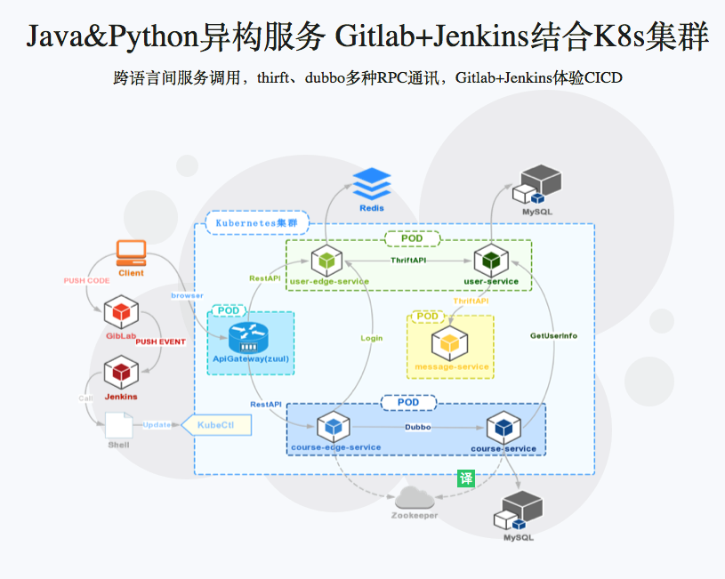

# Docker+Kubernetes(k8s)微服务容器化实践

来源：https://coding.imooc.com/class/198.html

从整体上把握微服务，体会服务Docker化，理解服务编排，以及主流的服务编排框架——Kubernetes，了解它的架构，知道它的运作原理，知道如何安装、使用及如何部署微服务

## 更新内容

项目根据视频内容，使用 SpringBoot 2.0 和 Java 11 进行了重构，更新内容如下：

- 使用 `Java 11` 新特性（`var`、`String.isBlank()`...）
- 使用 `SpringBoot 2.0`
- 使用 `com.alibaba.boot` -> `dubbo-spring-boot-starter` : `0.2.0`
- 使用 `IntelliJ IDEA 2018.2`

## 环境

- IDE：IntelliJ IDEA Ultimate 2018.2 
- Python： 3.7.0
- Java： 11
- Thrift： 0.11.0 
- Docker： 18.09.0-ce
- K8s： 1.11.0

## 服务整理

### 用户服务

- 用户登录
- 用户注册
- 用户基本信息查询
- 无状态、无session
- 单点登录

### 课程服务

- 登录验证
- 课程 CURD

### 信息服务

- 发送邮件
- 发送短信

### 用户 EdgeService

### 课程 EdgeService

### API Gateway